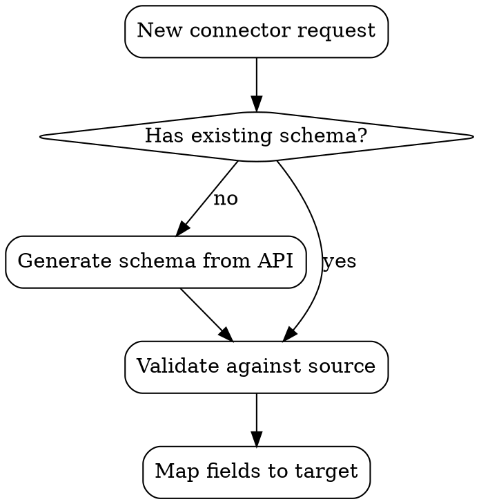

# Writing Patterns Reference

How to write effective skill instructions.

## Writing Style

### Imperative Form
Write instructions as commands, not suggestions:
- "Run the validator" not "You should run the validator"
- "Check the schema before mapping" not "It's a good idea to check the schema"

### Explain the Why
Explain reasoning instead of using heavy-handed MUSTs. Agents are smart —
when they understand WHY something matters, they follow it better than rote
rules.

```markdown
# BAD: Rigid rule without reasoning
ALWAYS run validation before deployment. NEVER skip this step.

# GOOD: Reasoning that motivates compliance
Run validation before deployment — unvalidated connectors can silently
corrupt data in production, and the corruption often isn't detected until
downstream consumers report inconsistencies days later.
```

If you find yourself writing ALWAYS or NEVER in all caps, reframe it as
reasoning. That approach is more humane, powerful, and effective.

### Generalize, Don't Overfit
Skills get used across many prompts. Write for the general case, not just
the test examples. If there's a stubborn issue, try different metaphors or
recommend different working patterns rather than adding overly specific rules.

## Output Format Templates

When consistency matters, define explicit templates:

```markdown
## Report Structure
Use this exact template:

# [Title]
## Executive Summary
## Key Findings
## Recommendations
```

## Examples Pattern

Include 1-2 concrete examples showing input → output:

```markdown
## Commit Message Format

**Example 1:**
Input: Added user authentication with JWT tokens
Output: feat(auth): implement JWT-based authentication

**Example 2:**
Input: Fixed crash when user has no email address
Output: fix(user): handle missing email in profile lookup
```

One excellent, realistic example beats five mediocre ones. Choose the example
that best shows the pattern. Avoid:
- Multi-language duplication (one language is enough, the agent can port)
- Fill-in-the-blank templates
- Contrived scenarios

## Flowcharts

Use flowcharts ONLY for non-obvious decision points:
- Process loops where you might stop too early
- "When to use A vs B" decisions
- Conditional branches that aren't intuitive

Never use flowcharts for:
- Reference material (use tables/lists)
- Code examples (use markdown blocks)
- Linear instructions (use numbered lists)

Flowchart format (Graphviz DOT):


Use semantic labels (what the step DOES), never generic labels (step1, helper2).

## Token Efficiency

Context window is shared. Every token in a skill is a token the agent can't
use for the actual task.

**Target word counts:**
- Getting-started skills: <150 words
- Frequently-loaded skills: <200 words
- Other skills: <500 words (still be concise)

**Techniques:**

Move details to tool help:
```markdown
# BAD: Document all flags
search-conversations supports --text, --both, --after DATE, --before DATE

# GOOD: Reference --help
search-conversations supports multiple modes. Run --help for details.
```

Use cross-references instead of repetition:
```markdown
# BAD: Repeat 20 lines of workflow details
[repeated instructions]

# GOOD: Reference other skill
Use the auth-setup sub-skill for authentication configuration.
```

Eliminate redundancy:
- Don't repeat what's in cross-referenced skills
- Don't explain what's obvious from the command
- Don't include multiple examples of the same pattern

## Cross-Referencing Skills

When referencing other skills, use explicit requirement markers:

```markdown
# GOOD: Clear dependency
**REQUIRED:** Use the schema-mapping sub-skill for field type conversion.

# GOOD: Optional reference
For advanced retry patterns, see the error-handling sub-skill.

# BAD: Unclear if required
See skills/testing/test-driven-development
```

Avoid force-loading referenced files (some platforms use `@` syntax that
immediately loads into context). Prefer name-based references that load
on demand.

## Naming Skills

- Lowercase letters, digits, hyphens only
- Under 64 characters
- Verb-led phrases: `create-connector`, `validate-schema`, `sync-data`
- Gerunds work for processes: `creating-skills`, `testing-connectors`
- Namespace by tool when helpful: `gh-review-pr`, `jira-sync-issue`
- Name the skill directory to match the skill name exactly

## Keyword Coverage

Embed searchable terms throughout the skill so agents can find it:
- Error messages the skill handles
- Symptoms: "flaky", "timeout", "schema mismatch"
- Synonyms: "connector/adapter/integration", "mapping/transform/convert"
- Tool names: specific APIs, libraries, file types
